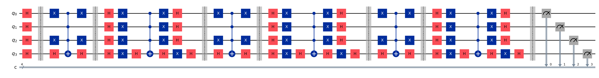
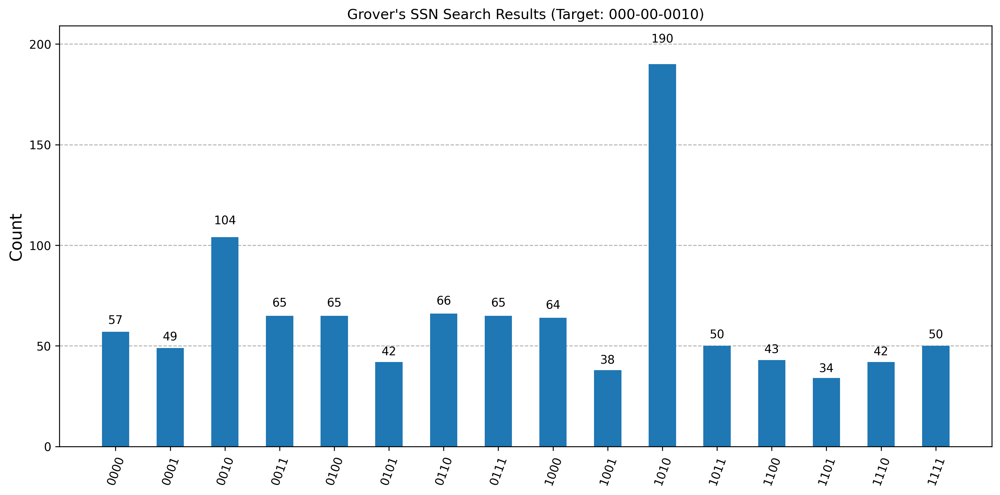

# Quantum-Experiments

A project for exploring basic quantum computing with Qiskit.

## Setup

1. Install dependencies:
```bash
pip install -r requirements.txt
```

2. Run the sample code locally:
```bash
python fast_search.py
```

3. To run on IBM Quantum hardware, setup your IBM API info in .env, then:
```python
python fast_search.py --use-ibm --qubits 4
```

## What's included

- `fast_search.py`: Implementation of Grover's algorithm for searching a mock database with `O(sqrt(N))` complexity
- `requirements.txt`: Python dependencies for Qiskit development
- Quantum circuit diagram is generated when running the code:

- Histogram of measurement results is also generated:
- 
